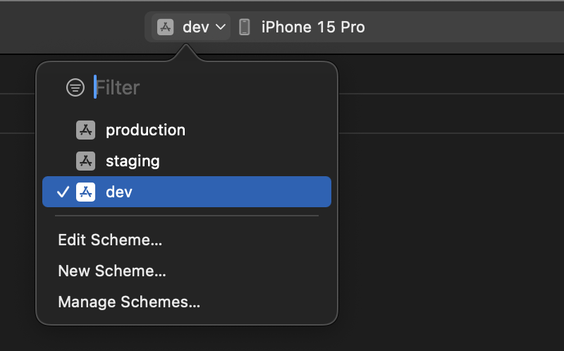

# react-native-environments-guide

According to the [twelve-factor app guidelines](https://12factor.net/config):

> an app’s config is everything that is likely to vary between deploys (staging, production, dev).

Moreover, a twelve-factor app:

> requires strict separation of config from code. Config varies substantially across deploys, code does not.

In the context of a React Native app, this means having:

1. a bunch of `.env` files, one for each environment
1. a script to build the app for a specific environment (and platform).

In the end, I want to make a build with a command-line invocation, like this:

```sh
fastlane ios build --env production
```

where `env` can be `production`, `staging` or `dev`.

---

To achieve this, I'll use [react-native-config](https://github.com/lugg/react-native-config), [Xcode build schemes](https://developer.apple.com/documentation/xcode/customizing-the-build-schemes-for-a-project/) and [Android product flavors](https://developer.android.com/build/build-variants#product-flavors).

- [Start here](#start-here)
- [Setup iOS](#setup-ios)
- [Setup Android]()
- [Write the build scripts]()
- [(Bonus) Validate env variables]()

## Start here

First, let's make sure we are on the same page. For this particular guide, I'm using the following package versions:

```sh
react-native@0.74
react-native-config@1.5.1
```

I want to set up 3 environments: `dev`, `staging`
and `production`. The naming is completely arbitrary, it can be anything you prefer (like `local`, `alpha` and `release`, as another example).

I'm creating a new `env` directory, where I'll place these three `.env.*` files.

```sh
mkdir env
touch ./env/.env.dev ./env/.env.staging ./env/.env.production
```

And in the project's root, an empty `.env` file, which I'll add add to `.gitignore`:

```sh
touch .env
echo ".env" >> .gitignore
```

> [!IMPORTANT]
> -- Why do I add it to `.gitignore`? The main `.env` will be the _working_ file, changed before every build to contain the desired environment variables. Considering its _volatile_ nature, it's not something we want to track in source control.

Now the directory structure looks like this:

```sh
/example
  /env
  ├── .env.dev
  ├── .env.production
  └── .env.staging
  .env
  ...
```

> [!TIP]
> -- using [tree](https://formulae.brew.sh/formula/tree) to pretty-print the directory content.

## Setup iOS

I'm relying on [Xcode build schemes](https://developer.apple.com/documentation/xcode/customizing-the-build-schemes-for-a-project/) to create one scheme per environment.



## Setup Android

TODO
